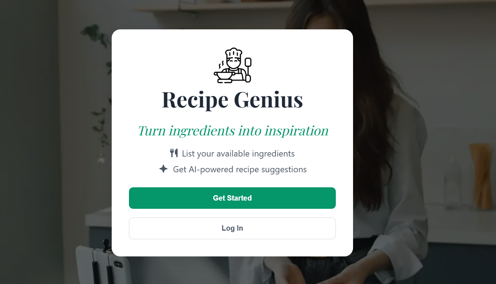
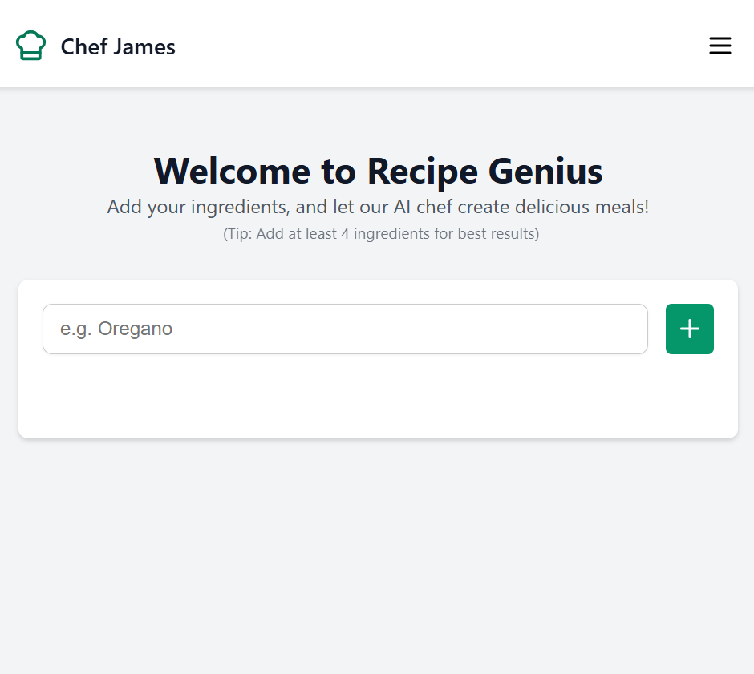
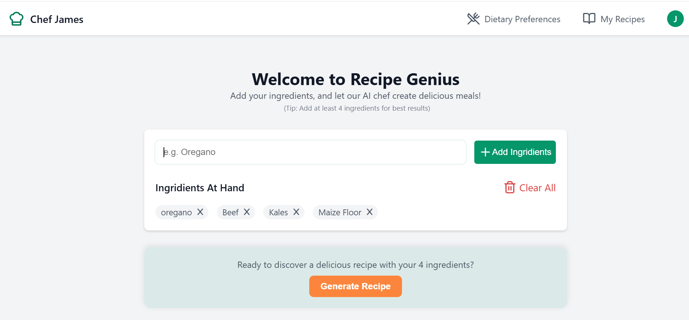

# Recipe Genius 🍴✨

Welcome to **Recipe Genius** — your go-to AI-powered recipe assistant that transforms your ingredients into mouthwatering dishes. Whether you're a home cook, a food enthusiast, or just trying to make the best out of what's in your fridge, Recipe Genius is here to make cooking fun, creative, and personalized.

---

## 🌐 [See Live](#)

_Experience Recipe Genius in action!_

---

## 📸 Screenshots

**Responsive Design in Action:**

<table>
  <tr>
    <td></td>
    <td></td>
    <td></td>
  </tr>
  <tr>
    <td align="center">Landing Page</td>
    <td align="center">Home Page Mobile</td>
    <td align="center">Home Page DeskTop</td>
  </tr>
</table>

---

## ✨ Features

### 🌟 Intuitive Signup and Login

Start cooking in no time with our seamless signup and login process. Personalize your account with your name and preferences for a unique experience.

### 🛠️ Customize by Name

We use your name to personalize interactions, making Recipe Genius feel like your personal sous chef.

### 🥗 Dietary and Allergy Preferences

Set your dietary restrictions and allergies, and let the app tailor recipes to your needs — because everyone deserves to enjoy safe, delicious meals.

### 🚀 Intuitive Navigation

Navigate with ease using our clean and simple UI, designed for both novice and experienced users.

### 🤖 AI-Powered Recipe Suggestions

Input your ingredients, and let the app generate creative and delicious recipes — perfect for using up leftovers or trying something new.

### 💾 Save Recipes

Save your favorite recipes to revisit them anytime.

### ❤️ Mark Favorite Recipes

Found a recipe you love? Mark it as a favorite and keep it close for quick access.

### 🔄 Edit and Update Details

Easily update your preferences, dietary information, or account details whenever you need.

### 🔒 Logout and Delete Account

Control your data with secure logout options and the ability to delete your account if needed.

---

## 📖 How It Works

1. **Sign Up**: Create an account with your name and email.
2. **Customize**: Add dietary preferences and allergies.
3. **Input Ingredients**: Enter the ingredients you have on hand.
4. **Get Recipes**: Let Recipe Genius provide you with AI-generated recipes tailored to your needs.
5. **Save and Favorite**: Bookmark your favorite recipes for later.
6. **Cook and Enjoy**: Turn your ingredients into delightful meals!

---

## 💻 Tech Stack

- **Frontend**: React, CSS, and responsive design principles.
- **Backend**: Node.js with Express and MongoDB.
- **AI Integration**: Hugging Face API for recipe generation.

---

## 🛠️ Installation

To get started locally:

1. Clone the repository:
   ```bash
   git clone https://github.com/gitere001/recipe-genius.git
   ```
2. Navigate to the project directory:
   ```bash
   cd recipe-genius
   ```
3. Install dependencies:
   ```bash
   npm install
   ```
4. Start the development server:
   ```bash
   npm start
   ```
5. Open your browser and go to `http://localhost:3000` to explore the app.

---

## 📧 Contact

Have questions or feedback? Feel free to reach out:

- **Website**: [jamesgiteredev.site](https://jamesgiteredev.site)
- **Email**: [contact@jamesgiteredev.site](mailto:contact@jamesgiteredev.site)

---

## 🌟 Contribute

We welcome contributions! Feel free to fork the repository, make improvements, and submit a pull request.

---

## 📜 License

This project is licensed under the [MIT License](LICENSE).
